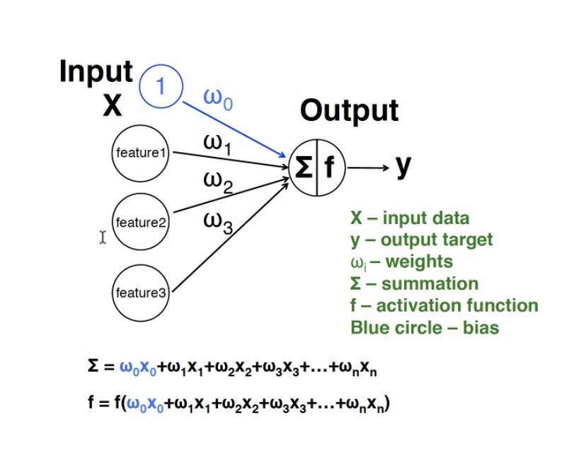
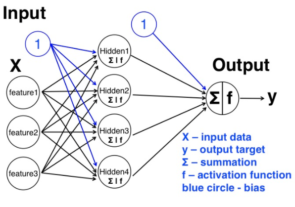

# Artificial Neural Net Workshop
## UCB D-Lab
## 04-23-21 

## Intro
- Focuses more on theory behind ANN
- Less on challenge problems
- https://github.com/dlab-berkeley/ANN-Fundamentals.git

## Machine learning
- Algorithms that take data and perform some kind of job, usually in a way that performs better over many repetitions
- Humans have context that ML lacks
- Neural networks
	- Charismatic name derived from how animal brain works
	- Neuron receives chem signal, activates or not, if activates sends signal to next neuron
	- Network of tiny cells communicating with signals >> solve problems

## Neural nets
- Started in 1940s: **PERCEPTRON** (McCulloch & Pitts, 1947)
- Had problem with more complex divisions of data
- 1980s - multilayer perceptron - combine a bunch of perceptron cells talking to each other
- 2006 - deep NN - many layers of cells, more complex structures, like recursive, convolutional, etc.
	- Can do more with more complex data structures
- Task is often **classification**
	- Take an unknown item, have machine decide which group it belongs to 
- input >> process >> output >> feedback >> input
	- hone in on best process that improves output and can improve it no further

## Structure

- input (predictive features)
	- diameter
	- texture
	- color
	- roundness
- bias term - sort of like intercept in regression
	- in case where you have 0 features, get no class decision unless you specify bias term
	- bias term lets you get a class activation even with all inputs 0
	- "what is class when X=0?"
- weights
	- tells cell in neural net how important specific inputs are
- hidden layer
	- takes inputs, performs some process on it
	- FUNCTIONS
- output layer
	- transforms results ffrom hidden layer into class decision
- inputs go to hidden layer with weights
	- tell it eyes matter more, e.g.
- feedback
	- update weights so you have better output

## Activation function
### Functional form
- Often use a sigmoid (logistic) estimation function
	- Logistic: $f(z) = \frac{1}{1+e^{-z}}$
	- Logistic': \frac{df(z)}{dx} = f(z)(1-f(z))$
- Target is binary, either 0 or 1
- Activation specified as a continous value
	- If activation = 0.7, error = 0.3

### Error terms
- $\epsilon = class\ decision - activation level$

## Weight updating (feedback)
- $\Delta_{weight} = error * slope * input$
- If this term is large, neural net will focus on improving these decisions - aims to minimize this term
- Tells you which features contributed to decision and update only those features that contributed to incorrect decision
- Slope of sigmoid function can help you modulate changes to weights
	- sigmoid slope is steepest closest to center - i.e., where decision is most ambiguous, or equivalently, error highest
	
## Learning rate
- ANother parameter for constraining $\delta_{weights}$
- One worry with updating inputs in this way, if you update too much in response to one feature, get network moving around too much, never converges on optimal decisions
- Multiply weight update by some ratio
- Instead of updating weight by, say, 1.39, update by 0.139 >> slows down learning and smooths its approach to figuring out optimal weight
- Can set = 1, which doesn't change update rate
- Risks unstable network
- Can also make it very small - moves so slowly down gradient that it just never gets to convergence
- Try 0.01 - 0.5

## Multi-layer Perceptron
- Perceptron really only works on linearly separable problems
- Where a straight line fails to differentiate between classes, perceptron can't classify
- Multi-layer Perceptron stacks a bunch of perceptrons in "hidden" layer

- Still specify activaiton function at each node
	- We know activation function and weights, but don't know what exactly algorithm is doing with data in middle
- Conceptually, just adding another layer
- So also need to add another bias term
- Can have many hidden layers 
	- Typically don't need many hidden layers

### Learning
- First, propagate info forward through network to output layer
	- The difference between single perceptron is that each node in input layer will pass info into all nodes in hidden layer
	- Basically, have multiple independent perceptrons that don't interact with each other
	- Sum individual perceptron decisions, using another set of weights, for final output
- Then, back propagate
	- we have multiple layers with two sets of weights that need to be updated each time
	
## MLP in scikit learn
- hidden_layer_sizes tells you how many hidden layers to have
	- in sample code, we have 3 layers, each with 30 nodes
	- how many is optimal? 
		- can decide thru tuning
		- but good idea to keep number of nodes constant
- each node is essentially ONE perceptron
- use same activation function for every layer, can't choose different functions
- max_iter - how many times to update weights
- softmax activation function - typically used in classification - takes last layer of nodes and transforms into n classes - however many you have - built in for you here
- activation - this is to define different activation functions.   
- alpha - this parameter controls regularization which helps avoid overfitting.
	 - helps balance the weights and helps avoid overfitting - penalizes networks with super variable weights
- solver - the option to choose different algorithm for weight optimization. 
- batch_size - size of minibatches for stochastic optimizers. This is the option that will decide how much samples will be used in [online learning](https://en.wikipedia.org/wiki/Online_machine_learning).   
- learning_rate - option to use different learning rate for weight updates. You can use constant learning rate, or changing the learning rate with progress.   
- max_iter - maximum number of iterations. This will decide when to stop the solver, either the solver converges (determined by 'tol') or this maximum number of iterations.  
- tol - tolerance for the optimization
	- eventually, network won't get substantially better
	- specify how small a change in weight the model should tolerate before shutting down
- momentum - momentum for gradient descent update. This will try to avoid trap the local minimum. 
